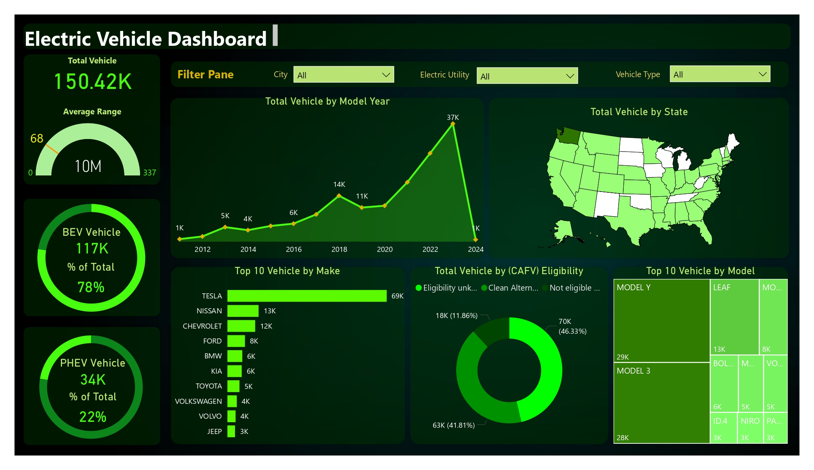

### Electric Vehicle Dashboard Overview:
- **Total Vehicle Count**: 150.42K, split into:
  - **BEV (Battery Electric Vehicle)**: 117K (78% of total)
  - **PHEV (Plug-in Hybrid Electric Vehicle)**: 34K (22% of total)
- **Average Range**: 68 miles
- **Vehicle Distribution by Model Year**: Includes data from 2012 to 2024, showing varying vehicle counts for each year.
- **Total Vehicles by State**: Visual representation of vehicle distribution across different states.
- **Top 10 Vehicle Makes**: Tesla, Nissan, Chevrolet, Ford, BMW, Kia, Toyota, Volkswagen, Volvo, and Jeep are highlighted.
- **Total Vehicles by CAFV (Clean Alternative Fuel Vehicle) Eligibility**: Shows the distribution of vehicles based on their eligibility status.
- **Top 10 Vehicle Models**: Lists models such as Tesla Model Y, Model 3, Nissan Leaf, Chevrolet Bolt, and others, ranked by their total numbers.

This dashboard provides an at-a-glance view of the distribution and characteristics of electric vehicles across various metrics.

